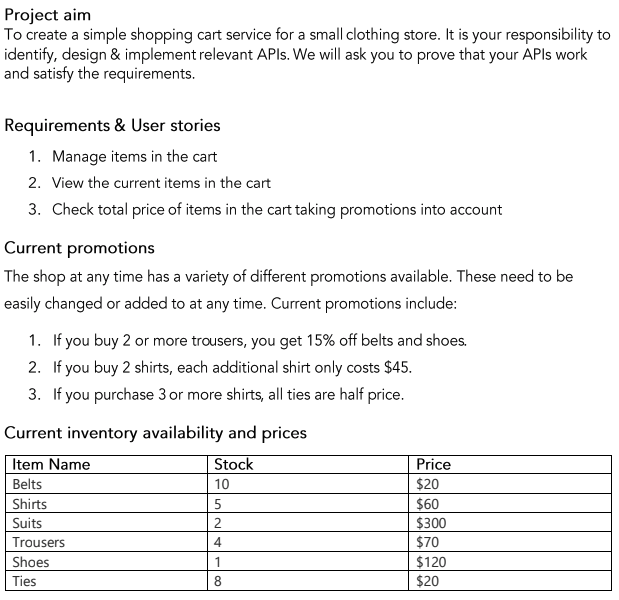

# Shopping cart API

Implementation of an API Service for an online shop

## Spec



## Assumptions

1. Using in-memory for DAO, the state can be persisted using a config file. However the DAO is an interface which can be implemented using a proper Database connection
2. Random 10 character access token generated, all endpoints going to `/v1/shopping/cart` are secured and expect a `Bearer` token in the `Authorization` header.
3. No unit tests generated as there wasn't enough time. Howevere there is a [Postman Collection](#Postman-Collection) available.

## Running

Runs with basic config in [cmd/api.shopping/config.go](cmd/api.shopping/config.go).
Optionally, a JSON config file can be passed via the `-config` flag

```sh
go build ./cmd/api.shopping/ && ./api.shopping -config config.json
```

## Postman collection

[Postman](_postman) collection available for testing
